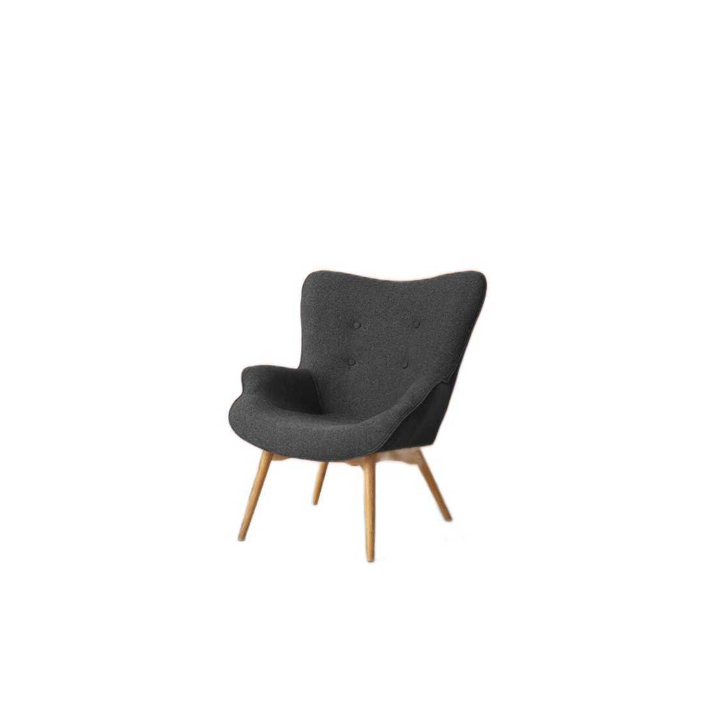

# Removebg - Background Removal Android Library

[](https://jitpack.io/#com.github.erenalpaslan/removebg)  [](https://opensource.org/licenses/MIT)<br>

The "removebg" Android library simplifies background removal from images using the U2Net model. With this library, you can quickly integrate background removal functionality into your Android app.

| Original Image | Background Removed Image |
| -------------- | ------------------------- |
|  |  |
|  |  |
|  |  |


## Installation

To include "removebg" in your Android project, add the following to your Gradle files:

```gradle
allprojects {
    repositories {
      ...
      maven { url 'https://jitpack.io' }
    }
}

dependencies {
    implementation 'com.github.erenalpaslan:removebg:1.0.3'
}
```

## Usage

Here's a quick example of how to use the "removebg" library in your Android app:

``` kotlin
val remover = RemoveBg(context)

remover.clearBackground(inputImage.value).collect { output ->
    outputImage.value = output
}
```

## Contributions and Issues

Contributions and issue reports are welcome! Feel free to contribute to the development of this library or report any problems you encounter.

## License

 * MIT ([LICENSE](LICENSE) or https://opensource.org/license/mit/)


